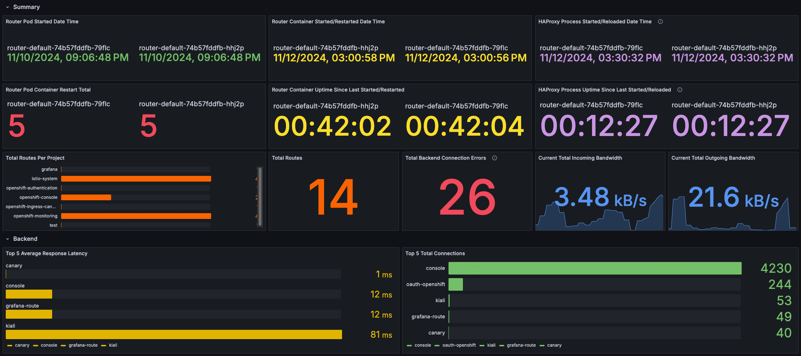
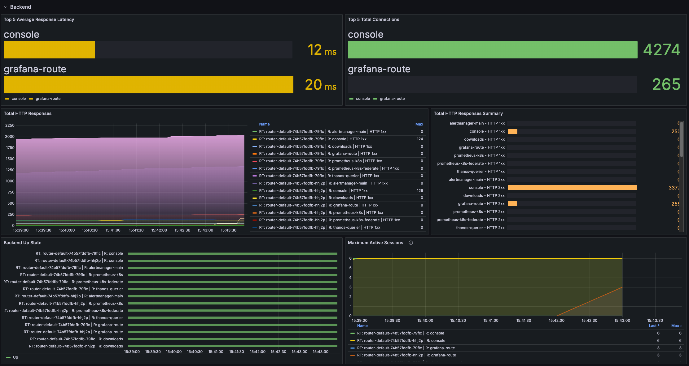
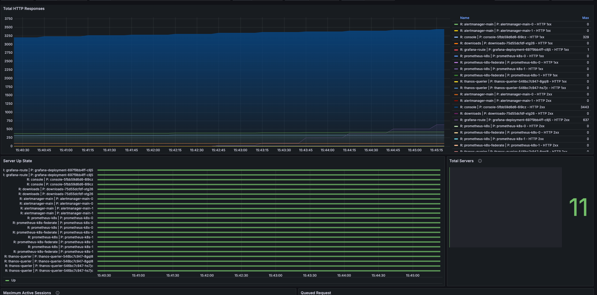

# OpenShift Ingress (HAProxy) Monitoring with Grafana

## Setup Grafana instance and dashboard

1. Open a terminal and login to cluster with the user that has cluster admin role using `oc login` command.
2. Run the `setup.sh` script to setup everything.
3. Login to Grafana web console with the URL and credential provided at the end of the script execution.

## How to setup alert on OpenShift

1. [Configure alert notifications](https://docs.openshift.com/container-platform/4.14/post_installation_configuration/configuring-alert-notifications.html)
2. [Create alerting rules](https://docs.openshift.com/container-platform/4.14/observability/monitoring/managing-alerts.html#creating-new-alerting-rules_managing-alerts)
3. [Manage alerts](https://docs.openshift.com/container-platform/4.14/observability/monitoring/managing-alerts.html)

Custom alert [example](https://github.com/rhthsa/openshift-demo/blob/main/custom-alert.md)

## How to get raw HAProxy metrics

SSH to one of router pod using `oc rsh` command or open the pod's terminal via OpenShift web console then run following commands:

```sh
USER=`cat metrics-auth/statsUsername`
PASS=`cat metrics-auth/statsPassword`
curl -u $USER:$PASS http://localhost:1936/metrics
```

Ref: [Expose router metrics](https://docs.openshift.com/container-platform/4.14/networking/ingress-operator.html#nw-exposing-router-metrics_configuring-ingress)

## Sample of dashboard screenshots




